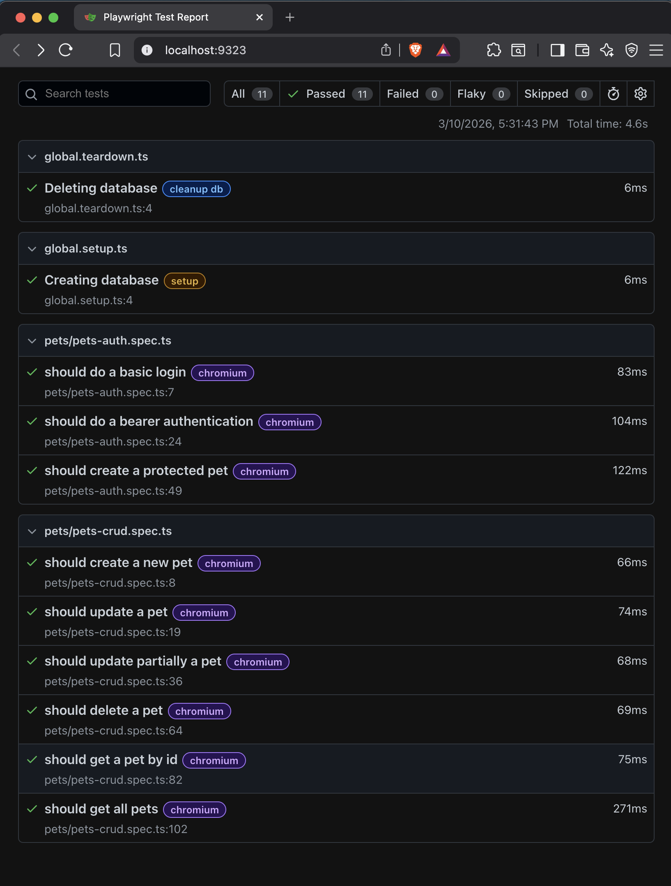

# Playwright API Test Framework Demo

This project demonstrates a REST API automation testing framework built with Playwright and Node.js.

The REST API server runs locally, so an internet connection is not required to execute the test scenarios.

## Features

* REST API test automation using Playwright
* Environment-based configuration
* Modular test architecture
* Centralized logging
* HTML reporting
* Local REST API server for offline testing

## Requirements

* Node.js 18+
* npm

## 1) Clone the project

```
git clone https://github.com/jfoxx-public/playwright-api-test-framework-demo.git
```

## 2) Install dependencies

```
npm install
```

## 3) Run the REST API server

### Option A: Run locally
```
cd resources/pets-demo
npm install
npm start
```

### Option B: Run with Docker
```
docker compose up --build pets-demo
```

You should see an output similar to:

```
Server is running on http://localhost:3000
```

### Service URL

http://localhost:3000

### Swagger Documentation

http://localhost:3000/api-docs

## 4) Run the tests

### Run all tests
```
npx playwright test
```

### Run tests with specific environment
```
ENV=qa npx playwright test
```

### Run tests in headed mode (with browser UI)
```
npx playwright test --headed
```

### Generate and view HTML report
```
npx playwright show-report
```

### Run tests in UI mode
```
npx playwright test --ui
```

## Environment Configuration

The framework supports multiple environments. Configure the target environment using the `ENV` environment variable:

- `dev` (default): http://localhost:3000
- `qa`: http://localhost:3001
- `staging`: http://localhost:3002
- `prod`: http://localhost:3003

Create a `.env` file based on `.env.example` to set your preferred environment.

### Swagger API Documentation

http://localhost:3000/api-docs

## 4) Run the test scenarios

```
npx playwright test
```

Tests can also be executed against different environments:

```
ENV=QA npx playwright test
```

Replace `QA` with the desired environment, for example:

* QA
* DEV
* STAGING
* PROD

## 5) View the HTML report

```
npx playwright show-report
```


## Project Structure

```
.
├── src/
│   ├── api/
│   │   ├── assertions/     # custom API assertions
│   │   ├── clients/        # API client wrappers
│   │   ├── constants/      # shared constants
│   │   ├── data/           # test data
│   │   ├── factories/      # test data builders
│   │   ├── fixtures/       # Playwright fixtures
│   │   └── types/          # TypeScript types
│   │
│   └── utils/
│       └── logger.ts       # centralized logger
│
├── tests/
│   ├── global.setup.ts
│   ├── global.teardown.ts
│   └── pets/
│       ├── pets-auth.spec.ts
│       └── pets-crud.spec.ts
│
├── resources/
│   └── pets-demo/          # local REST API server used for testing
│
├── playwright.config.ts
└── package.json
```

## Test Strategy

The framework follows a layered test architecture:

* **API client abstraction**
  Encapsulates HTTP requests to keep tests clean and reusable.

* **Fixtures**
  Playwright fixtures manage test setup and dependency injection.

* **Environment configuration**
  Tests can run against different environments using environment variables.

* **Logging**
  Centralized logging helps debugging failures and test execution tracking.

* **Reporting**
  Playwright HTML reports provide detailed execution results for each test run.
